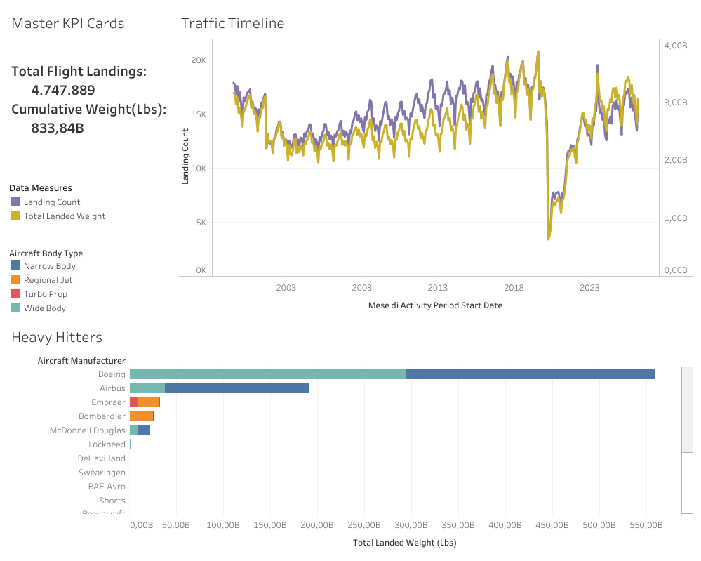

# Strategic Infrastructure Analysis: SFO Runway Stress & Fleet Consolidation

## Project Overview
An executive-level data visualization project analyzing over two decades of commercial aviation landing data at San Francisco International Airport (SFO). This project transforms complex relational data into actionable business intelligence to support multi-million dollar capital expenditure (CapEx) decisions regarding runway lifecycles and tarmac maintenance.

## Key Features & Insights
* **Dual-Axis Timeline:** Tracks the critical divergence between flight frequency and structural landing weight, revealing fleet consolidation trends.
* **Executive Visual Hierarchy:** Designed for high-level stakeholders using pre-attentive visual attributes and optimized space management.
* **Targeted Filtering:** Deploys custom Tableau Data Groups and Top-N filters to isolate heavy industry airframes driving 90% of runway degradation.

## Key Recommendations & Business Impact
* **Targeted Maintenance:** Align tarmac rehabilitation budgets with the seasonal tonnage peaks identified in the dual-axis timeline.
* **CapEx Prioritization:** Focus infrastructure spend on gate and taxiway upgrades for heavy-class carriers (Boeing/Airbus), as fleet consolidation proves they drive 90% of runway stress despite lower flight frequencies.

## Repository Contents
* `SFO_Air_Traffic_Analysis.twbx` - Packaged Tableau Workbook containing data connections and dashboards.
* `dashboard_preview.png` - Visual preview of the production-ready interactive layout.

## Live Project Link
* [View Interactive Dashboard Live on Tableau Public](https://public.tableau.com/views/Ait_traffic_anding_Statistics/TableauPublic)
